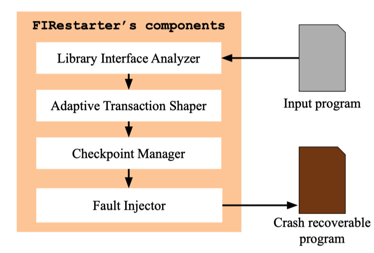

# Chaos engineering

## Fault injection

[19_HotCloud_Co-evolving Tracing and Fault Injection with Box of Pain](https://www.usenix.org/system/files/hotcloud19-paper-bittman.pdf)

This paper presents Box of Pain, a tracer and fault injector for unmodified distributed systems that addresses both concerns by interposing at the system call level and dynamically reconstructing the partial order of communication events based on causal relationships.

## Fault Recovery
[21_DSN_FIRestarter: Practical Software Crash Recovery with Targeted Library-level Fault Injection](https://download.vusec.net/papers/firestarter_dsn21.pdf)

FIRestarter injects targeted software faults at the library interface to automatically trigger error handling code for standard library calls already part of the application. In particular, when a crash occurs, we `roll back the application state before the last recoverable library call, inject a fault, and restart execution forcing the call to immediately return a predetermined error code.` This strategy allows the application to automatically bypass the crashing code upon such a restart and exploits existing error-handling code to recover from even persistent bugs.

[[code]](https://github.com/vusec/firestarter)