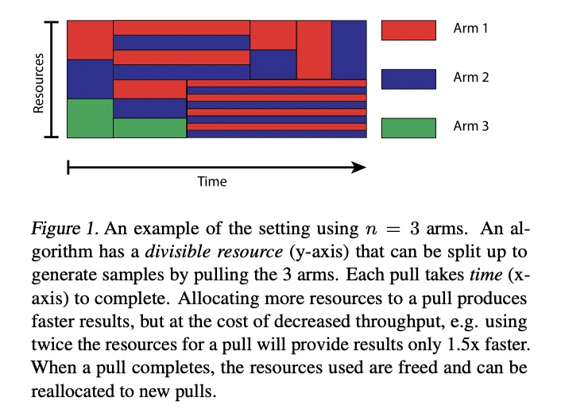

# Resource schedule

## Resource Allocation
- [21_ICML_Resource Allocation in Multi-armed Bandit Exploration:
Overcoming Sublinear Scaling with Adaptive Parallelism](http://proceedings.mlr.press/v139/thananjeyan21a/thananjeyan21a.pdf)

This paper proposes an adaptive parallelism Multi-armed Bandit algorithms to overcome sublinear scaling in resource allocation. Algorithms trades off between information accumulation, which allows us to invest resources in more promising candidates in future iterations, and throughput, which increases the overall number of samples. 

