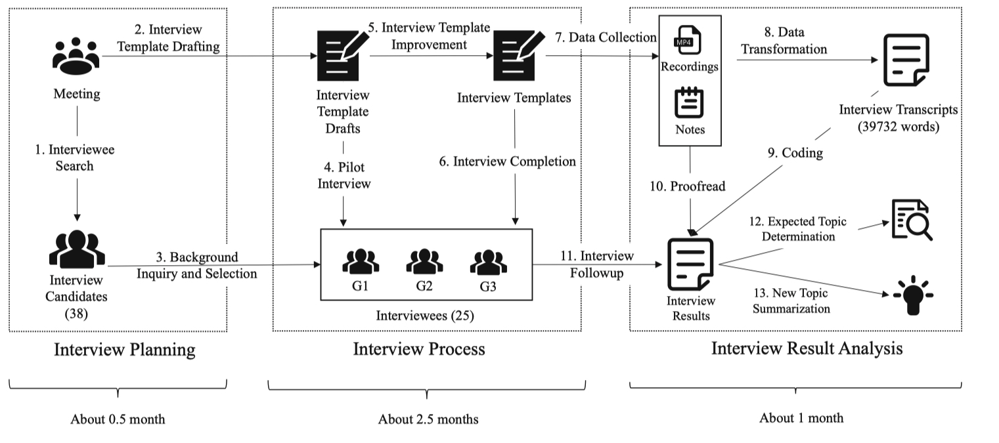

# Root cause analysis in distributed system

## Trace

- [22_Fudan_Enjoy your observability: an industrial survey of microservice tracing and analysis](https://link.springer.com/article/10.1007/s10664-021-10063-9)

This paper presents a industrial survey on microservice tracing and analysis through interviewing developers and operation engineers of microservice systems from ten companies.

