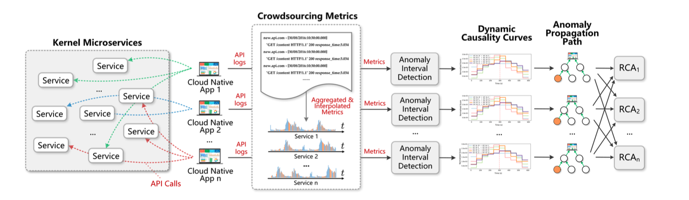
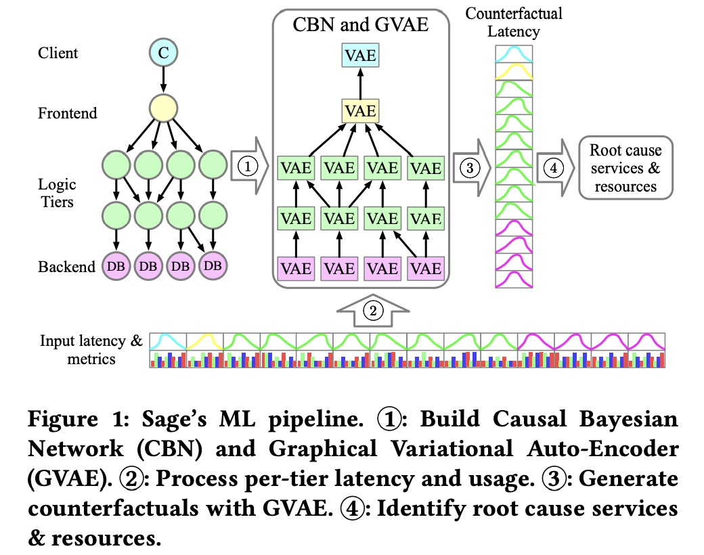

# Root cause analysis in distributed system

**Content**
- [Root cause analysis in distributed system](#root-cause-analysis-in-distributed-system)
  - [Metric](#metric)
  - [Trace](#trace)
  - [Log](#log)
  - [Metric and Trace](#metric-and-trace)

## Metric

## Trace

- [22_Fudan_Enjoy your observability: an industrial survey of microservice tracing and analysis](https://link.springer.com/article/10.1007/s10664-021-10063-9)

This paper presents a industrial survey on microservice tracing and analysis through interviewing developers and operation engineers of microservice systems from ten companies.

## Log
- [21_ISSTA_Faster, Deeper, Easier: Crowdsourcing Diagnosis of Microservice Kernel Failure from User Space](https://dl.acm.org/doi/abs/10.1145/3460319.3464805)

In this paper, log is first transformed into metric by `linear interpolation`. Then `SPOT` algorithm is used to do anomaly detection. A new causal inference method combining two methods, `Granger causality test`  and `Granger causal intervals`, is proposed in the anomaly interval to construct anomaly propagation links, and then a service dependency graph is constructed by fusing multiple links. Finally, a `backward breadth-first algorithm `is done on the service dependency graph for root cause localization. [[code]](https://github.com/PanYicheng/dycause_rca)

## Metric and Trace

- [21_ASPLOS_Sage: Practical & Scalable ML-Driven Performance Debugging in Microservices](https://www.csl.cornell.edu/~delimitrou/papers/2021.asplos.sage.pdf)

Sage uses `Causal Bayesian Networks`å to capture the dependencies between the microservices in an endto-end application topology, and `counterfactuals` (events that happen given certain alternative conditions in a hypothetical world) through a `Graphical Variational Autoencoder` to examine the impact of microservices on end-to-end performance.

