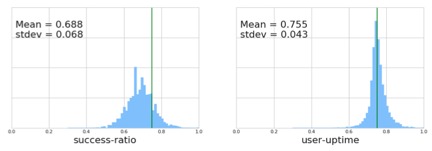

# Telemetry in cloud

**Content**
- [Telemetry in cloud](#telemetry-in-cloud)
  - [Metric](#metric)
  - [Log](#log)

## Metric

- [20_NSDI_Google_Meaningful Availability](https://www.usenix.org/system/files/nsdi20spring_hauer_prepub.pdf)

This paper presents and evaluates, in the context of Google’s G Suite, a novel availability metric: `windowed user-uptime`. This metric has two main components. First, it directly models user-perceived availability and avoids the bias in commonly used availability metrics. Second, by simultaneously calculating the availability metric over many windows it can readily distinguish between many short periods of unavailability and fewer but longer periods of unavailability.

- [19_VLDB_DDSketch: A Fast and Fully-Mergeable Quantile Sketch with Relative-Error Guarantees](http://www.vldb.org/pvldb/vol12/p2195-masson.pdf) 

Quantiles are famously impossible to compute exactly without holding on to all the data. If one wanted to track the median request latency over time for a web application that is handling millions of requests a second, this would mean sending millions of data points to the monitoring service which could then calculate the median by sorting the data. Given how expensive calculating exact quantiles can be for both storage and network bandwidth, most monitoring systems will compress the data into sketches and compute approximate quantiles. DDSketch is a flexible relativer error sketch that provides accurate latency quantiles.

[[code]](https://github.com/DataDog/sketches-py)

## Log

- [21_SRDS_What Distributed Systems Say: A Study of Seven Spark Application Logs](https://arxiv.org/pdf/2108.08395.pdf)

This paper provides a quantitative assessment of logging cost in different verbosity levels and how that translates to information gain in distributed systems.